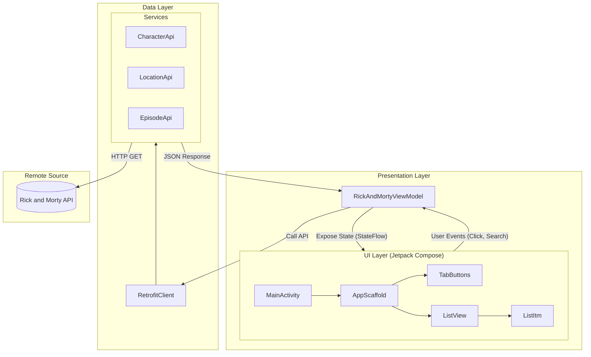

# RickAndMortyAPI Android App

Application Android native développée en Kotlin utilisant Jetpack Compose pour l'interface utilisateur. Elle consomme l'API publique Rick and Morty pour afficher les personnages, lieux et épisodes.

## 🛠 Tech Stack

- **Langage**: Kotlin
- **UI**: Jetpack Compose (Material3)
- **Architecture**: MVVM (Model-View-ViewModel)
- **Réseau**: Retrofit 2 + OkHttp
- **Parsing JSON**: Gson
- **Chargement d'images**: Coil 3
- **Asynchronisme**: Kotlin Coroutines & Flow

## 🏗 Architecture

Le projet suit l'architecture recommended **MVVM (Model-View-ViewModel)** pour séparer la logique métier de l'interface utilisateur.

### Composants Principaux

1.  **Model**: Classes de données (`Character`, `Location`, `Episode`) représentant les objets métier.
2.  **View (UI)**: Composants Jetpack Compose (`AppScaffold`, `ListItm`) qui observent l'état du ViewModel et affichent les données.
3.  **ViewModel** (`RickAndMortyViewModel`):
    - Gère l'état de l'interface (`RickAndMortyUIState`).
    - Exécute les appels réseaux via Retrofit.
    - Transforme les données brutes (JSON) en objets modèles via Gson.
4.  **Service (Data Layer)**: Interfaces Retrofit (`CharacterApi`, `LocationApi`, `EpisodeApi`) définissant les endpoints.

### Diagramme d'Architecture (High Level Graph)



## 🚀 Installation

1.  Cloner le dépôt.
2.  Ouvrir le projet dans **Android Studio**.
3.  Synchroniser les fichiers Gradle.
4.  Lancer l'application sur un émulateur ou un appareil physique.

## 📂 Structure du Projet

```
com.example.rickandmortyapi
├── MainActivity.kt          # Point d'entrée
├── models/                  # Data classes (Character, Episode, etc.)
├── service/                 # Interface Retrofit & Client
├── ui/
│   ├── composables/         # Composants UI réutilisables
│   ├── theme/               # Thème de l'application
│   └── uiStates/            # États de l'UI (Loading, Success, Error)
└── viewModel/               # Logique métier (RickAndMortyViewModel)
```
