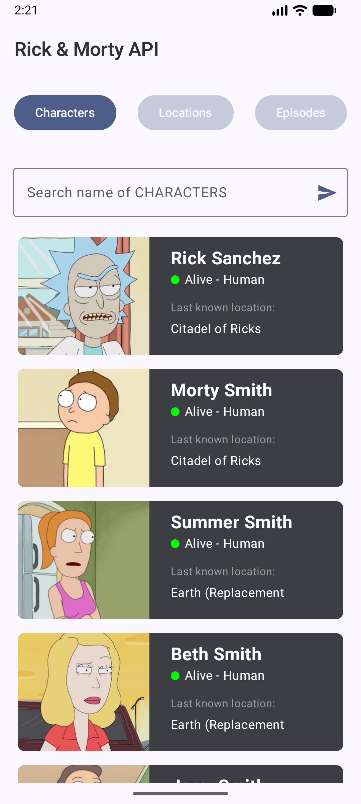
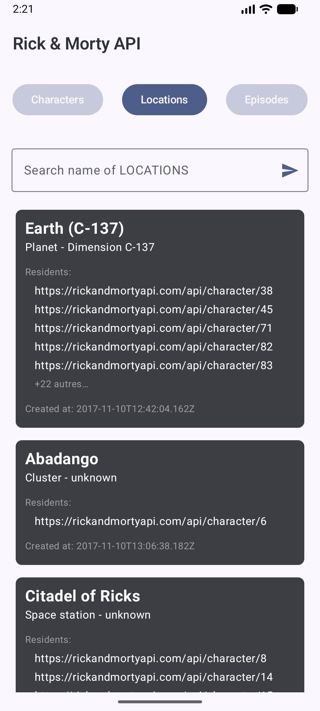
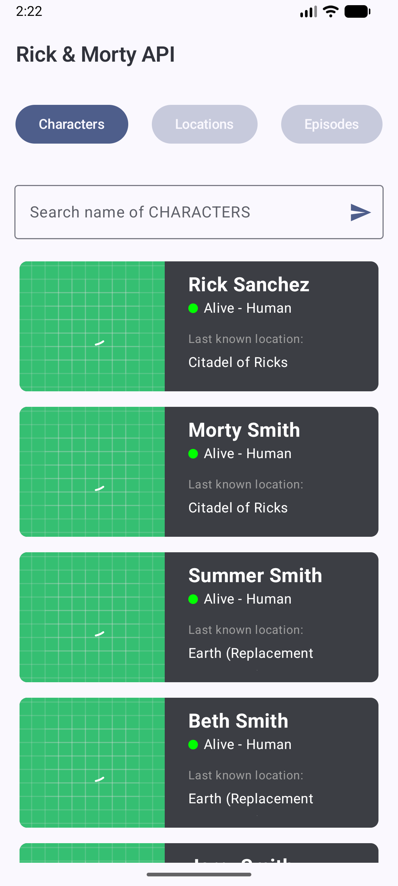
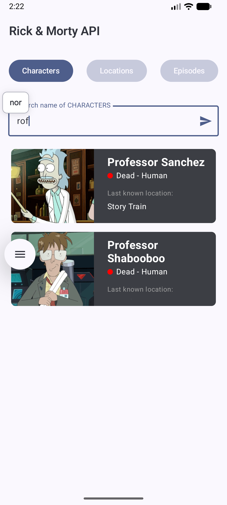
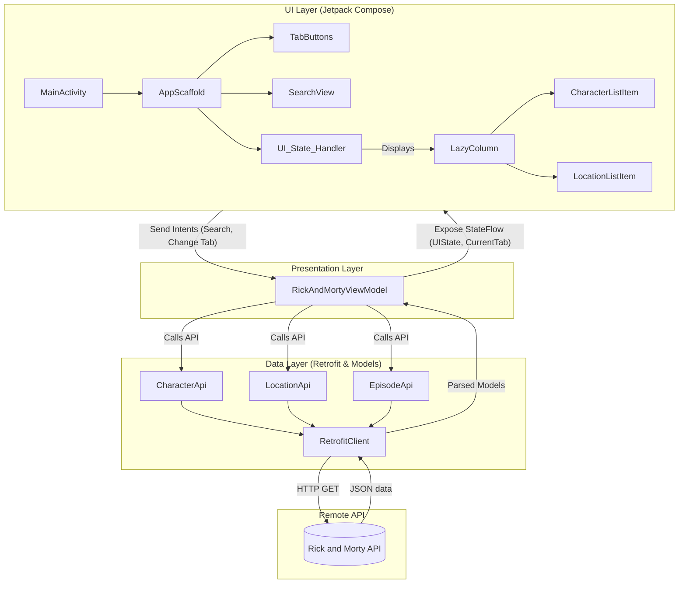

# Rick and Morty Android App

Une application native Android développée en Kotlin utilisant Jetpack Compose pour naviguer et rechercher dans l'univers de la série "Rick and Morty" via l'[API publique Rick and Morty](https://rickandmortyapi.com/).

## ✨ Fonctionnalités Principales

L'application est structurée autour d'une interface claire et intuitive :

- **Navigation par Onglets (Tabs)** : Permet de basculer facilement entre les trois catégories principales de l'API :
  - **Characters** (Personnages)
  - **Locations** (Lieux)
  - **Episodes** (Épisodes)
- **Recherche par Nom** : Une barre de recherche intégrée (SearchView) permet de filtrer dynamiquement les résultats en fonction de l'onglet sélectionné (ex: recherche d'un personnage spécifique ou d'un lieu).
- **Affichage en Liste Dynamique** : Utilisation de `LazyColumn` pour un défilement fluide des résultats. Des composants UI dédiés (`CharacterListItem`, `LocationListItem`) formatent les données de manière esthétique.
- **Chargement Asynchrone d'Images** : Affichage des avatars des personnages générés via la librairie Coil 3.
- **Gestion des États de l'Interface (UI States)** : Gestion propre et réactive des états asynchrones (`LOADING`, `SUCCESS`, `ERROR`) assurant une bonne expérience utilisateur en cas de chargement ou de problème réseau.

## � Captures d'écran

|                         Characters Tab                          |                         Location Tab                         |                           Loading State                            |                          Search Query                           |
| :-------------------------------------------------------------: | :----------------------------------------------------------: | :----------------------------------------------------------------: | :-------------------------------------------------------------: |
|  |  |  |  |

## �🛠 Stack Technique

- **Langage** : Kotlin
- **Interface Graphique (UI)** : Jetpack Compose (Material Design 3)
- **Architecture** : MVVM (Model-View-ViewModel) pour une séparation stricte des préoccupations.
- **Couche Réseau (Network)** : Retrofit 2 + OkHttp
- **Parsing JSON** : Gson
- **Affichage d'Images** : Coil 3 (`coil-compose` et `coil-network-okhttp`)
- **Asynchronisme & Flux de données** : Kotlin Coroutines & StateFlow

## 🏗 Architecture (Aperçu)

Le projet suit fidèlement le patron d'architecture **MVVM (Model-View-ViewModel)** recommandé par Google.

### Diagramme d'Architecture



## 🚀 Installation & Lancement

1.  **Cloner le dépôt** sur votre machine locale.
2.  **Ouvrir le projet** avec **Android Studio** (Assurez-vous d'avoir une version récente supportant les plugins `8.x`/`9.x` de l'Android Gradle Plugin).
3.  **Synchroniser le projet avec les fichiers Gradle** (Sync Project with Gradle Files).
4.  **Déployer l'application** (`Run 'app'`) sur un émulateur Android ou un appareil physique branché en USB/WiFi (Android 7.0 / API 24 minimum).

## 📂 Structure du Répertoire Source

Voici la cartographie des paquets dans `com.example.rickandmortyapi` :

```text
com.example.rickandmortyapi
├── MainActivity.kt          # Point d'entrée de l'application (setContent)
├── models/                  # Classes de données Pojo/Data Classes (Character, Location, APIResponse...)
├── service/                 # Configuration réseau : Client Retrofit, Base URL, Interfaces APIs
├── ui/                      # Tout ce qui concerne l'aspect visuel de l'app
│   ├── composables/         # Éléments réutilisables (ListItm, Scaffold, SearchView, TabButtons...)
│   ├── theme/               # Couleurs, Typographie et Thème général Material3
│   └── uiStates/            # Sealed classes représentant les états (Ex: RickAndMortyUIState)
└── viewModel/               # Logique d'application (RickAndMortyViewModel handling searches/API calls)
```
